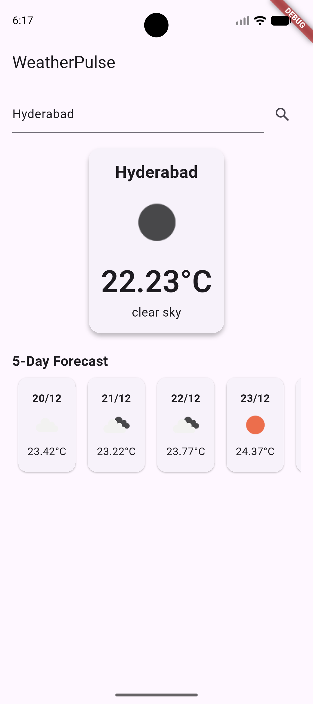
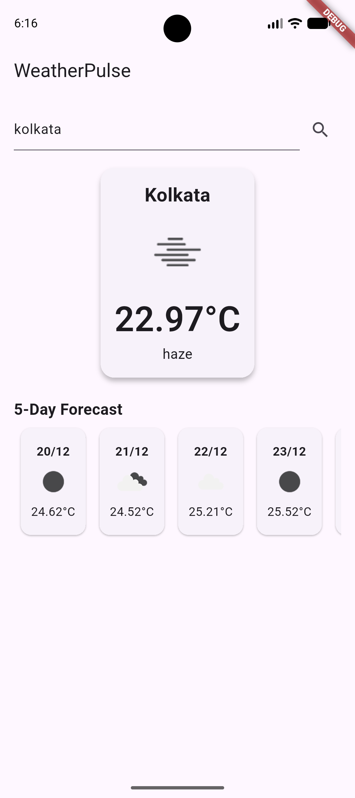

# weather_pulse

A Flutter mobile app to display current weather and 5-day forecast using OpenWeatherMap API.

This project demonstrates API integration, state management (Riverpod), clean code architecture, persistence, and responsive UI.

## Features :

- Search weather by city name

- Display current weather: temperature, description, icon

- Show 5-day forecast in a horizontal list

- Current location weather using GPS

- Save last searched city using SharedPreferences

- Responsive UI for different screen sizes

- Null-safe Flutter code

- Basic error handling for city not found or network issues

- State management using Riverpod

- Clean project structure with separation of UI, Data, and Logic layers


## Getting Started 

### Prerequisites
```
Flutter SDK (>=3.7)

Android Studio / VS Code

Internet connection

OpenWeatherMap API Key
```

## Installation

#### 1. Clone the repository:
```
git clone https://github.com/sad-arindam/weatherpulse.git
```

#### 2. Navigate into the project:
```
cd weatherpulse
```

#### 3. Install dependencies:
```
flutter pub get
```

#### 4. Add OpenWeatherMap API key in:
```
lib/services/weather_service.dart

final String _apiKey = 'API_KEY';
```

#### 5. Run the app:
```
flutter run
```

## Project Structure
```
lib/
 ├─ main.dart             # App entry point
 ├─ screens/
 │    └─ home_screen.dart # Home screen UI
 ├─ widgets/
 │    └─ forecast_list.dart # Forecast horizontal list widget
 ├─ models/
 │    ├─ weather.dart     # Weather data model
 │    └─ forecast.dart    # Forecast data model
 ├─ services/
 │    └─ weather_service.dart # API calls
 ├─ providers/
 │    └─ weather_provider.dart # Riverpod providers
 └─ utils/
      └─ location_service.dart # Geolocator service
```

## State Management 

* Riverpod is used for:

    - Current weather by city

    - Current location weather

    - 5-day forecast

    - Last searched city (SharedPreferences)


## Error Handling

- City not found → Displays error text

- No internet connection → Displays error message

- Location permission denied → Displays alert


## Dependencies

* flutter_riverpod → State management

* http → API requests

* geolocator → GPS location

* shared_preferences → Store last searched city

### Notes

The app is responsive and works on both Android and desktop emulators.

Designed to showcase API integration, clean architecture, and state management.

## Developer

Arindam Ojha

Linkedin : [https:/www.linkedin.com/in/arindamojha](https:/www.linkedin.com/in/arindamojha)

Email: arindamojha10@gmail.com


## Screenshots 

Home Screen / Current Weather:


5-Day Forecast:

  

  

